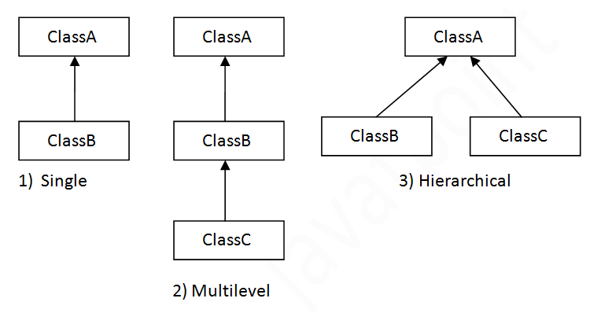
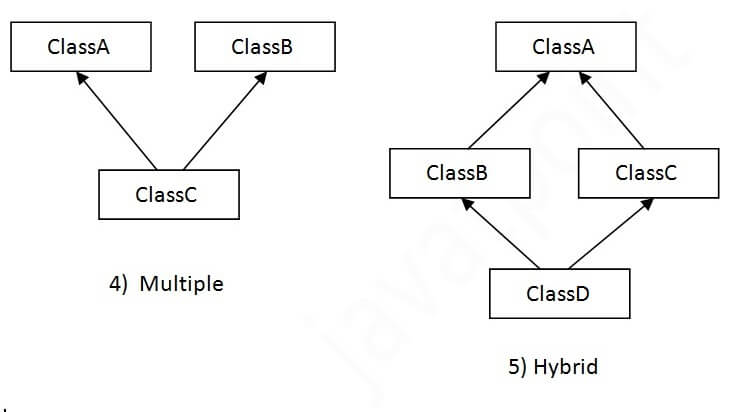

# Inheritance

Inheritance in python programming is the concept of deriving a new class from an existing class.
Using the concept of inheritance we can inherit the properties of the existing class to our new class.
The new derived class is called the Drived/child class and the existing class is called the Base/parent class.

Advantages of Inheritance

1. Code Reusability: It improves code reusability. We don't need to write the same code again and again.
   Using inheritance, we can inherit the features of other classes and also add more features to the derived class.
2. Reduces the Programmers Efforts: Programmers do not need to write the same code and logic.
   Hence it reduces the efforts of programmers.
3. Readability: By implementing concepts of inheritance, the program looks more concise and structured. Which makes it easy to read. This way inheritance also improves the readability of code.

================================
Types of Inheritance in Python Programming
Types of inheritance: There are five types of inheritance in python programming:

1). Single inheritance
2). Multiple inheritances
3). Multilevel inheritance
4). Hierarchical inheritance
5). Hybrid inheritance

(i).    Single inheritance: When child class is derived from only one parent class.
        This is called single inheritance. The example we did above is the best 		     example for single inheritance
        in python programming.

(ii).   Multiple Inheritance: When child class is derived or inherited from more than one parent class.
        This is called multiple inheritance. In multiple inheritance, we have two or more parent classes/base classes
        and one child class that inherits both parent classes properties.

(iii).  Multilevel Inheritance: In multilevel inheritance, we have one parent class and child class that is derived
        or inherited from that parent class. We have a grand-child class that is derived from the child class.
        See the below-given flow diagram to understand more clearly.

(iV).   Hierarchical inheritance: When we derive or inherit more than one child 	class from one(same) parent class.
        Then this type of inheritance is called hierarchical inheritance.

(V).    Hybrid Inheritance: Hybrid inheritance satisfies more than one form of inheritance
        ie. It may be consists of all types of inheritance that we have done above.
        It is not wrong if we say Hybrid Inheritance is the combinations of simple, multiple, multilevel and
        hierarchical inheritance. This type of inheritance is very helpful if we want to use concepts of inheritance
        without any limitations according to our requirements.

